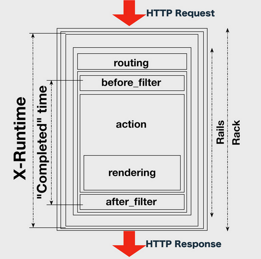

# Rack::LtsvLogger

A rack middleware to output access log in ltsv format, like [rack/commonlogger](https://github.com/rack/rack/blob/master/lib/rack/commonlogger.rb) (which output access log in apache common format).

## Why Rack Middleware

cf. https://speakerdeck.com/mirakui/high-performance-rails-long-edition



The Completed Time does not include routing time, and elapsed time on rack middleware layers, and so on.
To measure the processing time accurately, it is necessary to insert a rack middleware to measure the time. 

## Installation

Add this line to your application's Gemfile:

    gem 'rack-ltsvlogger'

And then execute:

    $ bundle

## How to Use

Insert Rack::LtsvLogger on the head of rack middlewares. 

Rails)

Add following to config/environments/[env].rb

```ruby
require 'rack/ltsvlogger'
require 'logger'

config.middleware.insert_after(0, Rack::LtsvLogger, $stdout)
```

Sinatra)

```ruby
# config.ru
require 'rack/ltsvlogger'

use Rack::LtsvLogger, $stdout
run App
```

## Format

Sample (line feeded):

```
time:2014-07-02T21:52:31+09:00  pid:15189       host:127.0.0.1  forwardedfor:127.0.0.2  user:user
method:GET      uri:/get        query:?foo      protocol:HTTP/1.1       status:200      size:-  reqtime:0.000000
```

### Default Fields

* time

  * The datetime in ISO-8601 format

* pid

  * Process ID

* host

  * ENV['REMOTE_ADDR']

* forwardedfor

  * ENV['X_FORWARDED_FOR']

* user

  * ENV['REMOTE_USER']

* method

  * ENV['REQUEST_METHOD']

* uri

  * ENV['PATH_INFO']

* query

  * ENV['QUERY_STRING']

* protocol

  * ENV['HTTP_VERSION']

* status

  * Response Status Code

* size

  * Response Content-Length

* reqtime

  * The request time in secods. milli seconds are written after the decimal point. 

* Others

  * See http://ltsv.org/

### Custom Fields

You may append LTSV fields as:

```ruby
appends = {
  vhost: Proc.new {|env| env['HTTP_HOST'] || "-" },
  ua: Proc.new {|env| env['HTTP_USER_AGENT'] || "-" },
  referer: Proc.new {|env| env['HTTP_REFERER'] || "-" },
}
config.middleware.insert_after(0, Rack::LtsvLogger, $stdout, appends)
```

## ChangeLog

See [CHANGELOG.md](CHANGELOG.md) for details.

## Contributing

1. Fork it
2. Create your feature branch (`git checkout -b my-new-feature`)
3. Commit your changes (`git commit -am 'Add some feature'`)
4. Push to the branch (`git push origin my-new-feature`)
5. Create new [Pull Request](../../pull/new/master)

## Copyright

See [LICENSE.txt](LICENSE.txt) for details.
